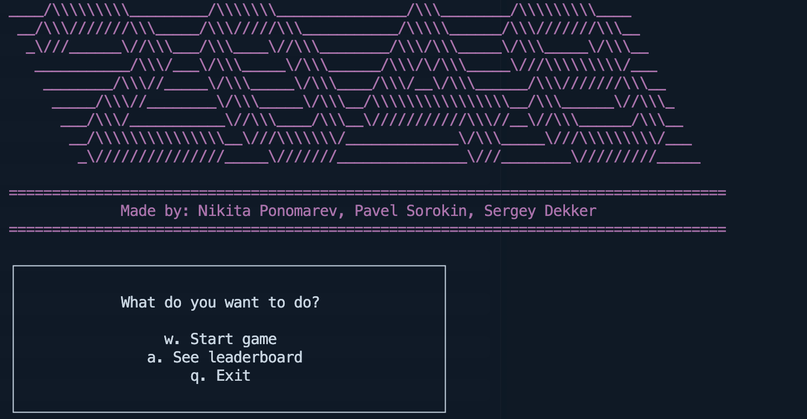

# 2048C

Welcome to the classic 2048 game implemented in C! This project provides a console-based version of the popular puzzle game, where the goal is to slide numbered tiles on a 4x4 grid to combine them and create a tile with the number 2048. The game is simple to play but challenging to master.

# Building

for macOS/Linux run `make`

for windows: 😢

# Running

Execute the compiled binary in a directory `./main2048`
